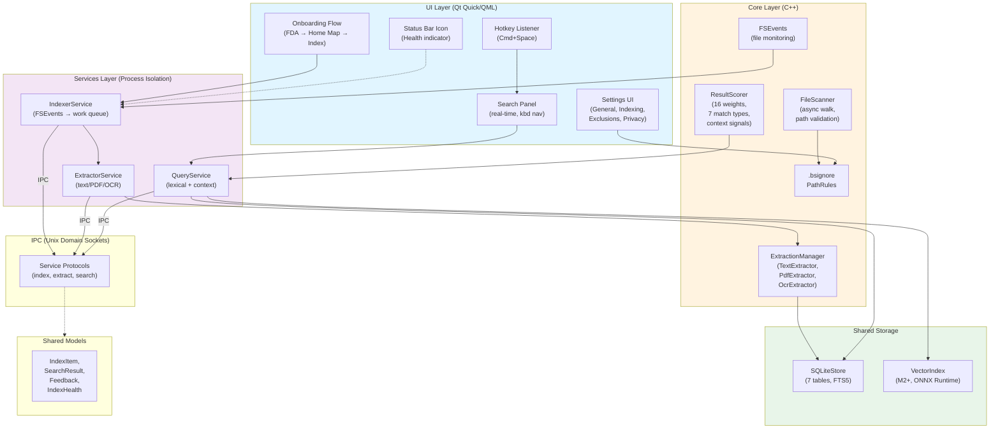

# BetterSpotlight: Architecture Overview

## Purpose

BetterSpotlight is a Spotlight replacement for technical macOS users and developers. This document describes the high-level system design of the Qt 6/C++ rewrite, intended for principal engineers and the core development team. The system prioritizes offline-first reliability, minimal noise, and efficient file indexing via Full Disk Access.

---

## System Overview

BetterSpotlight follows a **layered, service-oriented architecture** with four major components:

1. **UI Layer**: Qt Quick/QML frontend, hotkey integration, search panel, settings, and onboarding
2. **Core Layer**: File system monitoring, content extraction, indexing, and ranking
3. **Services Layer**: Process-isolated indexer, extractor, and query services for crash resilience
4. **Shared Layer**: Data models, IPC protocols, and ignore system

The system is **offline-first** and operates within Full Disk Access permissions. It does not compete with Raycast's extension ecosystem; it focuses on reliable, configurable file search for power users.

---

## Component Architecture

### 1. UI Layer (Qt Quick/QML)

#### Hotkey & Search Panel
- **Global hotkey listener** (default Cmd+Space) triggers search panel
- **Floating search panel** with:
  - Real-time results as user types
  - Keyboard navigation (↑/↓ to navigate, Enter to open, Cmd+R to reveal in Finder, Cmd+Shift+C to copy path, Esc to close)
  - Snippet preview and highlight context from indexed content
  - Uses Qt 6.10+ SearchField component for native styling

#### Settings UI
- **Tabs**: General, Indexing, Exclusions, Privacy, Index Health
- General: hotkey binding, auto-start, noise/privacy preferences
- Indexing: index status, pause/resume, manual reindex
- Exclusions: view and edit .bsignore rules
- Privacy: data retention, analytics opt-out
- Index Health: database stats, cache size, rebuild options

#### Onboarding Flow
1. FDA permission request with explanation
2. Home Map: classify top-level directories (search, ignore, project root)
3. Initial indexing with progress feedback

#### Status Bar Icon
- Shows index health (green/yellow/red)
- Menu provides quick access to settings and index status

---

### 2. Core Layer (C++)

#### File System Monitoring (FSEvents)
- **FSEvents (macOS CoreServices API)** monitors the file system for changes
- Feeds into the IndexerService via event queue
- Respects .bsignore rules before queueing work
- Cross-platform abstraction defined; Linux/Windows use inotify/ReadDirectoryChangesW respectively

#### File Scanner
- **FileScanner** performs async directory walking with concurrency control
- Validates paths against **PathRules** (exclusion patterns, classification markers)
- Supports .bsignore format (gitignore-style) with 30+ built-in default patterns
- Detects and classifies directory types: project roots (.git/.hg/.svn), configuration, library, cache

#### Extraction Manager
- **ExtractionManager** coordinates text, PDF, and OCR extraction with concurrency limits
- **TextExtractor**: 100+ file types including code (C++, Python, JavaScript, etc.), config (YAML, JSON, TOML), markdown, plaintext
- **PdfExtractor**: Via Poppler (development) / PDFium (release builds) per ADR-006 (Accepted), 1000-page limit per file, automatic chunking at word/sentence/paragraph boundaries
- **OcrExtractor**: Via Tesseract, text position ordering for spatial context
- Extracted content chunked for FTS5 insertion; metadata stored separately

#### Indexing: SQLiteStore
- **SQLite database** with **WAL mode** for concurrent reads during indexing
- **7 normalized tables**:
  - Files: id, path, kind, size, modified, indexed_at
  - FileContent: id, file_id, chunk_text, chunk_order, start_char
  - Metadata: id, file_id, extracted_text, lang_code, page_count
  - Frequency: id, file_id, access_count, last_accessed
  - Pinned: id, file_id, pin_reason, created_at
  - VectorData: id, file_id, embedding (M2+)
  - Health: index_version, last_scan, file_count, error_count
- **FTS5 lexical search**: Porter stemmer, Unicode61 tokenizer, BM25 ranking
- Vector index as optional interface for M2+ (placeholder now, ONNX Runtime expected)

#### Ranking: ResultScorer
- **16 configurable weights** controlling relevance
- **7 match types**: filename exact, filename prefix, filename fuzzy, content exact, content prefix, content fuzzy, content semantic (M2+)
- **Recency decay**: recent files rank higher; configurable decay rate
- **Frequency boost**: frequently accessed files elevated
- **Pinned items**: manual overrides for frequent searches
- **Context boosting**:
  - CWD proximity: files in or near current working directory boost
  - App-context detection: 40+ known app types (IDE, browser, terminal, etc.) boost relevant file types
  - Clipboard awareness (M3+): match against copied paths/text
  - Project-graph awareness (M3+): dependencies between files
- **Junk penalties**: Downloads folder, cache, temp files deprioritized

---

### 3. Services Layer (Process Isolation)

Three separate processes for crash isolation and independent scaling:

#### IndexerService
- Monitors FSEvents and file system state
- Maintains work queue with priority ordering (recent files first, deletes first)
- Pause/resume capability for user control
- Batch processing with configurable chunk sizes
- Reports health and progress to main app via IPC

#### ExtractorService
- Delegates to ExtractionManager for text, PDF, OCR
- Handles metadata extraction (file type, language, page count)
- Returns extracted content and metadata to IndexerService
- Crash isolation: extractor failure does not crash indexer or search

#### QueryService
- Combines **lexical search** (FTS5) + **frequency** + **recency** + **context signals** for ranking
- Returns scored SearchResult objects to UI
- Health snapshots: reports current index status
- Feedback recording: logs user selections for training (M2+)

#### IPC (Interprocess Communication)
**Decided:** Unix domain sockets (see ADR-004).

- Platform-independent protocol
- Serialization via JSON or binary format
- Latency acceptable for search workloads
- Cross-platform support (macOS, Linux, Windows)

Service protocols define:
- IndexerService: `index_directory`, `pause`, `resume`, `get_status`
- ExtractorService: `extract_text`, `extract_pdf`, `extract_ocr`
- QueryService: `search`, `get_health`, `record_feedback`

---

### 4. Shared Layer

#### Data Models (serializable across IPC)
- **IndexItem**: path, kind, size, modified_time, indexed_at
- **SearchResult**: path, snippet, match_type, score, app_context
- **Feedback**: query, selected_result, rank, timestamp
- **IndexHealth**: file_count, indexed_size, last_scan, error_count, vector_coverage (M2+)
- **Settings**: hotkey_code, exclusion_patterns, context_weights, privacy_flags

#### Ignore System: .bsignore
- Gitignore-style file format for path exclusion
- Editable via Settings UI and CLI
- Ships with 30+ built-in patterns (node_modules, .git, Library/Caches, etc.)
- Evaluated at FileScanner level before queueing indexing work

---

## Data Flow (Critical Path)

### Indexing Pipeline
```
FSEvents detects file change
  ↓
FileScanner validates path against PathRules/.bsignore
  ↓
IndexerService queues work item
  (priority: recent files first, deletes first)
  ↓
ExtractorService extracts text/PDF/OCR content
  ↓
Content chunked at word/sentence/paragraph boundaries
  ↓
Chunks inserted into FTS5 lexical index via SQLiteStore
  ↓
Metadata stored in normalized SQLite tables
  ↓
(M2: optional embedding computed via ONNX Runtime → Vector index)
```

### Query Pipeline
```
User types in search panel
  ↓
QueryService receives query string
  ↓
FTS5 lexical search with BM25 ranking
  ↓
Context signals applied: recency decay, frequency boost, CWD proximity, app-context detection
  ↓
Results scored and ranked by ResultScorer
  ↓
Top N results returned to UI with snippets and highlights
```

---

## Architecture Diagram



---

## Design Decisions

### Resolved Decisions (ADRs)

| Decision | Rationale | Reference |
|----------|-----------|-----------|
| Qt 6/C++ over Swift/SwiftUI | Native C++ for extraction, indexing; Qt for cross-platform UI potential; better control over async patterns | ADR-001 |
| FTS5 for lexical search | Proven in-process search, Porter stemmer, Unicode support, BM25 ranking built-in | ADR-002 |
| FSEvents for file watching | Native macOS API, efficient, integrates with Finder updates | ADR-003 |
| Process isolation via separate binaries | Crash resilience, independent scaling, simpler memory models | ADR-004 |
| Tesseract for OCR | Open-source, portable, adequate accuracy for indexing use case | ADR-005 |
| PDF library: Poppler (dev) / PDFium (release) | Poppler for development iteration; PDFium (Apache 2.0) for proprietary release builds | ADR-006 |

### Open Questions Resolved in M1

**Cloud Sync Folders** (Dropbox, Google Drive, etc.)
- Index by default; no special treatment
- Exclude sync artifacts (.dropbox.cache, .tmp sync files, .gdoc stubs) via default .bsignore
- Deprioritize in work queue behind local paths
- User-configurable via .bsignore for further customization

**Downloads Folder**
- Fully indexed; no exclusion by default
- Ranking system's recency decay and junk penalties naturally deprioritize old downloads
- No special handling needed

**Repo Root Detection**
- M1: Basic detection via .git/.hg/.svn markers at directory level
- M2+: Nested submodules and monorepo support deferred

**Vector Index**
- M2+: ONNX Runtime as likely runtime
- Model selection and training data deferred to M2 research phase
- Interface defined now: accepts float arrays, returns cosine similarity ranked matches
- Allows plug-and-play replacement when ready

**Context Signals Roadmap**
- **M1**: CWD proximity + recency only (sufficient for basic use case)
- **M2**: Frequency boost + app-context detection (40+ app types)
- **M3**: Clipboard awareness + project-graph awareness (speculative, user feedback driven)

---

## Milestone Roadmap

### M1: Basic Spotlight Replacement
- File indexing end-to-end (FSEvents → extraction → FTS5)
- Search returns results for filename and content queries
- Hotkey activation and floating search panel
- Basic UI (search, minimal settings)
- Onboarding with FDA permission and Home Map
- **Target reliability**: 80% (core features)

### M2: ML Integration & Stability
- Local embedding model via ONNX Runtime
- Semantic search via vector index
- Refined context signals: app-context detection, frequency boost
- Settings and onboarding polish
- Error recovery and logging
- **Target reliability**: 90%+

### M3: Polished Application
- Full settings UI (Exclusions, Privacy, Health dashboard)
- Clipboard and project-graph awareness
- Advanced exclusion rules and custom context weights
- Comprehensive health dashboard with rebuild tools
- **Target reliability**: 95%+

---

## Cross-Platform Considerations

**macOS-specific Components**
- **FSEvents**: Core file monitoring (macOS-only). Abstraction boundary defined; Linux uses inotify, Windows uses ReadDirectoryChangesW
- **IPC**: Decided as Unix domain sockets (see ADR-004). Portable across macOS, Linux, Windows

**Cross-platform Components**
- Tesseract, Poppler/MuPDF, ONNX Runtime, SQLite: all available on macOS, Linux, Windows
- Qt 6: natively targets macOS, Windows, Linux
- Core extraction and indexing logic is platform-agnostic

**Implications**
- Search engine and indexing pipeline can be reused on other platforms with minimal changes
- File system monitoring and IPC layers require platform-specific bindings
- UI layer (Qt) provides native look-and-feel on all supported platforms

---

## Non-Goals & Constraints

- **Does not compete with Raycast extensions**: BetterSpotlight focuses on reliable file search, not a general application launcher or scripting platform
- **FDA required**: Users must grant Full Disk Access; the system cannot operate without it
- **Offline-first**: No cloud sync, no collaborative features
- **No web search, calculator, or system commands**: Spotlight-replacement scope only
- **macOS M1/M2+ initially**: Support for Intel Macs deferred pending testing; vector index tuning targets Apple Silicon

---

## Development Guidelines

1. **Service isolation**: Changes to one service should not require changes to others. Use versioned IPC protocols for compatibility
2. **Testing**: Unit test core algorithms (scoring, extraction, FTS5 queries). Integration tests for IPC and end-to-end pipelines
3. **Logging**: Structured logging in IndexerService and QueryService for debugging user issues
4. **Performance**: Profile extraction and FTS5 queries regularly. Aim for <100ms search latency for 1M-file indexes
5. **Documentation**: Keep ADRs updated as decisions evolve. Add code comments for non-obvious ranking weights and extraction heuristics

---

## References

- Qt 6 Documentation: https://doc.qt.io/qt-6/
- SQLite FTS5: https://www.sqlite.org/fts5.html
- ONNX Runtime: https://onnxruntime.ai/
- Tesseract OCR: https://github.com/UB-Mannheim/tesseract/wiki
- Poppler/MuPDF: Compare via ADR-006
