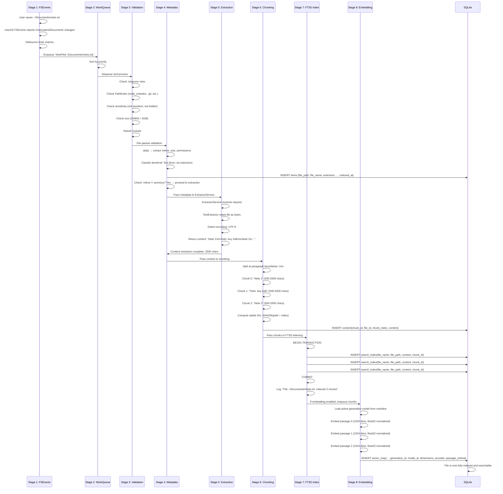

# BetterSpotlight: Indexing Pipeline Design

> 2026-02-11 update: Semantic indexing moved to generation-aware dual-index operation.
> `vector_map` now tracks `generation_id`, `model_id`, `dimensions`, provider, and migration state.
> Active generation cutover is atomic (`v1` legacy, `v2` 1024d target), and health payloads expose
> migration progress and aggregate per-service RSS telemetry.

**Document ID:** indexing-pipeline
**Status:** Final
**Last Updated:** 2026-02-06
**Audience:** Backend engineers, architecture reviewers
**Related Docs:** [Acceptance Criteria](../milestones/acceptance-criteria.md), [Storage Schema](./storage-schema.md)

## Executive Summary

This document defines the complete data flow from filesystem change detection through FTS5 index population. The Swift scaffold in the original codebase failed to wire Stage 7 (FTS5 Indexing) into the pipeline, resulting in an index that was never populated. This document prevents that architectural gap from recurring by making the indexing pipeline an explicit contract: every file must pass validation and reach FTS5 insertion or be logged as permanently failed.

**Critical Invariant:** There exists no code path where a file passes Stage 3 (Path Validation) but fails to attempt Stage 7 (FTS5 Indexing) without being logged.

---

## Architecture Overview

The indexing pipeline consists of eight sequential stages, with feedback loops for retry and state management:

```
FSEvents (Stage 1)
    ↓
Work Queue (Stage 2)
    ↓
Path Validation (Stage 3) ──[SKIP if excluded]──→ Delete from index
    ↓
Metadata Extraction (Stage 4)
    ↓
Content Extraction (Stage 5) ──[ExtractorService]──→ Timeout/Error Handling
    ↓
Chunking (Stage 6)
    ↓
FTS5 Indexing (Stage 7) ◄──── CRITICAL GATE
    ↓
Optional Embedding (Stage 8) [M2 systems only]
```

Each stage has explicit success/failure contracts and logging requirements.

---

## Stage 1: Change Detection via FSEvents

### Responsibility
Detect filesystem changes and feed them into the indexing pipeline without loss.

### Implementation Details

#### FSEvents Stream Registration
- Use `FSEvents.h` from CoreServices framework
- Create event stream for each indexed root (typically just the user's home directory, but support multiple roots for test environments)
- Event stream creation:
  ```cpp
  CFArrayRef pathsToWatch = CFArrayCreate(
      kCFAllocatorDefault,
      (const void**)&watchPath,
      1,
      &kCFTypeArrayCallBacks
  );

  FSEventStreamRef stream = FSEventStreamCreate(
      kCFAllocatorDefault,
      fsEventsCallback,
      &context,
      pathsToWatch,
      kFSEventStreamEventIdSinceNow,
      kDefaultLatency, // 500ms recommended for user-facing responsiveness
      kFSEventStreamCreateFlagNoDefer |
      kFSEventStreamCreateFlagWatchRoot |
      kFSEventStreamCreateFlagUseExtendedData
  );

  FSEventStreamScheduleWithRunLoop(stream, CFRunLoopGetMain(),
                                    kCFRunLoopDefaultMode);
  FSEventStreamStart(stream);
  ```

#### Event Coalescing
- FSEvents automatically coalesces events at the directory level (not at the file level)
- A single FSEventsCallback may report: `paths = ["/Users/alice/Documents", "/Users/alice/Downloads"]`
- Each path in the callback represents a directory where changes occurred
- **Do not assume file-level granularity**: if `/Users/alice/Documents/project/src/main.cpp` changes, the event reports `/Users/alice/Documents` (or possibly `/Users/alice/Documents/project`), depending on when the stream last coalesced
- This is a feature, not a bug: it prevents event storms and is handled by Stage 2

#### Debouncing
- After receiving a batch of FSEvents in the callback, do not immediately enqueue work items
- Instead, start a debounce timer (configurable, default 500ms)
- If new events arrive during the timer, reset the timer and extend the coalesce window
- When the timer expires, scan the reported directories and diff against stored metadata to find actual changes
- This reduces redundant work: 100 rapid file changes → 1 batch scan instead of 100 separate scans

#### Event Contents
- `paths`: array of directory paths where changes occurred
- `eventIds`: event ID sequence number (for resuming on restart, though we don't persist queue state)
- Event flags indicate: `Created`, `Removed`, `Renamed`, `Modified`, `OwnerModified`, `Mount`, `Unmount`, etc.
- For indexing purposes, treat all non-`Mount`/`Unmount` events the same way: schedule a directory re-scan

#### On Event Reception
1. Extract directory paths from FSEvents callback
2. Record event ID and paths in a buffer
3. If debounce timer is running, reset it
4. If debounce timer is not running, start it
5. When debounce timer expires:
   - For each reported directory: read current filesystem state (recursive `readdir`)
   - Diff against `items` table entries for that directory's subtree
   - Generate change list: new files, modified files (mtime or size changed), deleted files
   - Enqueue work items to Stage 2 for each change

#### Error Handling
- If FSEvents stream creation fails, log critical error and fall back to periodic background re-scan (Stage 2, lowest priority)
- If `readdir` fails for a specific directory (permissions, filesystem error), log warning and skip that directory; do not fail the entire event batch
- If debounce timer expires but work queue is full (Stage 2 backpressure), log warning and drop oldest items from the queue

---

## Stage 2: Work Queue

### Responsibility
Organize work items by priority and manage backpressure.

### Work Item Definition
```cpp
struct WorkItem {
    enum class Type {
        Delete,                 // File was deleted
        ModifiedContent,        // File content changed (mtime or size differs)
        NewFile,               // File is new (not in items table)
        RescanDirectory,       // Background re-scan of entire directory
    };

    Type type;
    std::string filePath;
    std::optional<uint64_t> knownModTime;  // For detecting changes
    std::optional<uint64_t> knownSize;
    int retryCount = 0;
};
```

### Priority Ordering
Items are processed in this order (highest to lowest priority):

1. **Delete operations** (priority 0, highest)
   - Reason: freeing space is fast and unblocks other operations
   - Processing time: ~10ms per deletion

2. **Modified files in recently-accessed directories** (priority 1)
   - "Recently-accessed" defined as: current working directory, any directory opened in Finder within the last 10 minutes, or any directory with recent file edits
   - Reason: user likely cares about these files now
   - Processing time: ~100ms per file (metadata + extraction)

3. **Modified files in other directories** (priority 2)
   - File exists in `items` table, but mtime or size has changed
   - Processing time: ~100ms per file

4. **New files** (priority 3)
   - Not yet in `items` table
   - Processing time: ~100-500ms per file depending on size and type

5. **Background re-scan** (priority 4, lowest)
   - Periodic validation of entire indexed roots
   - Runs only when higher-priority work is empty
   - Processing time: ~1-2 seconds per 1000 files

### Queue Implementation
```cpp
class WorkQueue {
private:
    std::priority_queue<WorkItem, std::vector<WorkItem>,
                       std::function<bool(const WorkItem&, const WorkItem&)>> queue;
    std::mutex queueMutex;
    static constexpr size_t MAX_QUEUE_SIZE = 10000;

public:
    void enqueue(const WorkItem& item) {
        std::lock_guard lock(queueMutex);
        if (queue.size() >= MAX_QUEUE_SIZE) {
            // Drop the lowest-priority item(s)
            // Pop items with priority >= 3 (background re-scans) until under limit
            std::vector<WorkItem> saved;
            while (queue.size() >= MAX_QUEUE_SIZE && queue.top().type == WorkItem::Type::RescanDirectory) {
                queue.pop();
            }
            if (queue.size() < MAX_QUEUE_SIZE) {
                queue.push(item);
                logWarning("WorkQueue exceeded capacity; dropped background re-scan items");
            } else {
                logWarning("WorkQueue at capacity; dropping new item: " + item.filePath);
            }
        } else {
            queue.push(item);
        }
    }

    std::optional<WorkItem> dequeue() {
        std::lock_guard lock(queueMutex);
        if (queue.empty()) return std::nullopt;
        auto item = queue.top();
        queue.pop();
        return item;
    }

    bool isPaused = false;
    void pause() { isPaused = true; }
    void resume() { isPaused = false; }
};
```

### Backpressure Strategy
- If queue size exceeds 10,000 items, log warning
- Drop lowest-priority items (background re-scans) first
- If queue is still over capacity, refuse new items until the queue drains below 8,000
- Log dropped items; do not silently lose them

### Persistence Across Restarts
- **Do not persist queue state** across application restarts
- On restart, the next Stage 1 event (or the background re-scan in Stage 2) will re-detect any changes since the last indexed state
- This simplifies the design: no need to journal work items or manage crash recovery

### Pause and Resume
- Indexing can be paused (e.g., user enters presentation mode, or CPU usage exceeds 80%)
- When paused:
  - FSEvents callbacks still arrive, and events are debounced and buffered
  - Work queue does not dequeue items
  - Metadata extraction, content extraction, and FTS5 updates do not proceed
- When resumed:
  - Continue processing the work queue from where it left off
  - No items are lost

---

## Stage 3: Path Validation

### Responsibility
Filter out unwanted paths before expensive processing. Determine if file should be fully indexed or metadata-only indexed.

### Processing Contract
```cpp
enum class ValidationResult {
    Include,           // Index file fully (metadata + content + FTS5)
    MetadataOnly,      // Store path/size/dates but skip content extraction
    Exclude,           // Skip entirely; delete from index if present
};

ValidationResult validatePath(const std::string& filePath,
                              const PathRules& rules,
                              const SensitivityClassifier& classifier);
```

### Validation Rules (in order of evaluation)

#### 1. .bsignore File Matching
- Load `.bsignore` from `~/.bsignore` (user's home directory)
- Support glob patterns: `*.log`, `build/**`, `node_modules/` (with `/` suffix indicating directories)
- Support prefix matching: `temp_*` matches `temp_file.txt`, `temp_dir/file.txt`
- Support line comments: `# comment`
- Empty lines and whitespace-only lines are ignored
- Glob matching is case-sensitive on all platforms (even macOS with case-insensitive filesystems)
- If a file matches `.bsignore`, return `Exclude`

#### 2. Built-in PathRules Exclusions
- Maintain a compiled list of 30+ patterns for common artifacts that should never be indexed:
  ```
  .git/objects/**
  .git/hooks/**
  node_modules/**
  .yarn/cache/**
  .next/**
  dist/**
  build/**
  __pycache__/**
  .tox/**
  .cargo/**
  target/release/**
  venv/**
  .venv/**
  vendor/**
  [Ll]ibrary/Caches/**
  [Ll]ibrary/Application Support/[Cc]rash[Rr]eporter/**
  .DS_Store
  .localized
  ._*  (resource forks)
  .TemporaryItems/**
  .Trashes/**
  .fseventsd/**
  Thumbs.db
  ehthumbs.db
  .dropbox/
  .dropbox.cache/
  .tmp/**  (Dropbox sync artifacts)
  .gdoc.tmp
  .gsheet.tmp
  Icon\r  (with actual carriage return)
  ```
- If a file matches any built-in rule, return `Exclude`
- PathRules should be compilable to a trie or DFA for O(1) or O(log n) lookup

#### 3. Sensitivity Classification
- Classify paths into: `Normal`, `Sensitive`, `Hidden`
- `Sensitive` paths (containing `/Library/`, `/ApplicationSupport/`, `/Preferences/`, etc.) are indexed metadata-only; content is not extracted
- `Hidden` paths (starting with `.`, or marked hidden via `xattr com.apple.metadata:com_apple_backup_excludeItem`) are excluded entirely
- If path is `Sensitive`, return `MetadataOnly`
- If path is `Hidden`, return `Exclude`

#### 4. Cloud Folder Detection
- Detect cloud sync folders and index them fully (both metadata AND content extraction):
  - **Dropbox**: Folder contains `.dropbox` file or `.dropbox-dist` folder → `Include` (full indexing)
  - **Google Drive**: Folder contains `.~google-drive-root` or `My Drive` symlink → `Include` (full indexing)
  - **OneDrive**: Folder contains `OneDrive_folder_placeholder.ini` → `Include` (full indexing)
  - **iCloud Drive**: Folder contains `.icloud_folder_attributes.plist` → `Include` (full indexing)
- Rationale: cloud sync folders are fully indexed because users store files there and search them. Sync artifacts (below) are excluded separately.

#### 5. Cloud Sync Artifact Exclusion
- Files matching these patterns within any indexed directory are excluded:
  - `.dropbox.cache/**`
  - `.tmp/**` (Dropbox temporary sync files)
  - `.gdoc.tmp`, `.gsheet.tmp` (Google Drive URL stubs)
  - `Icon\r` (macOS resource fork remnants)
  - `.icloud` extension files with zero size (iCloud Drive stubs)
- If file matches, return `Exclude`

#### 6. Size Filter
- File size > 5GB → `Exclude` (too large to be user-generated text; likely video, VM image, etc.)
- Rationale: prevents indexing entire video libraries or accidentally mounted ISO images

### Decision Table
```
┌─────────────────────┬────────────────────────────────────┐
│ Condition           │ Result                             │
├─────────────────────┼────────────────────────────────────┤
│ Matches .bsignore   │ Exclude                            │
│ Matches PathRules   │ Exclude                            │
│ Matches cloud       │ FullIndex (index content normally)  │
│ artifact rules      │                                    │
│ Is Hidden           │ Exclude                            │
│ Is Sensitive        │ MetadataOnly                       │
│ Size > 5GB          │ Exclude                            │
│ Otherwise           │ Include                            │
└─────────────────────┴────────────────────────────────────┘
```

### Error Handling
- If a file's permissions prevent reading metadata (path validation check fails with `EACCES`), log warning and exclude the file
- If `.bsignore` file is malformed (invalid glob pattern), log warning and use defaults only (do not fail the entire scan)

---

## Stage 4: Metadata Extraction

### Responsibility
Extract basic filesystem metadata from every non-excluded file.

### Extracted Fields
```cpp
struct FileMetadata {
    std::string filePath;        // Absolute path
    std::string fileName;        // Basename only
    std::string extension;       // Lowercase, including dot: ".txt", ".pdf"
    uint64_t fileSize;          // Bytes
    time_t creationTime;        // POSIX timestamp
    time_t modificationTime;    // POSIX timestamp
    uint16_t permissions;       // Unix-style mode
    bool isReadable;           // Can we read file content?
    ItemKind itemKind;         // Computed classification
};

enum class ItemKind {
    Directory,
    Text,                    // .txt, .md, .rst, etc.
    Code,                    // .cpp, .py, .js, etc.
    Markdown,               // .md, .mdx, .markdown
    Pdf,                    // .pdf
    Image,                  // .png, .jpg, .webp, etc.
    Archive,                // .zip, .tar, .rar, etc.
    Binary,                 // Executable, library, etc.
    Unknown,
};
```

### Implementation
```cpp
FileMetadata extractMetadata(const std::string& filePath) {
    struct stat st;
    if (stat(filePath.c_str(), &st) != 0) {
        throw std::runtime_error("stat failed: " + std::string(strerror(errno)));
    }

    FileMetadata meta;
    meta.filePath = filePath;
    meta.fileName = std::filesystem::path(filePath).filename().string();
    meta.extension = computeExtension(meta.fileName);
    meta.fileSize = st.st_size;
    meta.creationTime = st.st_birthtime;  // macOS-specific
    meta.modificationTime = st.st_mtime;
    meta.permissions = st.st_mode & 0777;
    meta.isReadable = (access(filePath.c_str(), R_OK) == 0);
    meta.itemKind = classifyItemKind(meta.extension, meta.fileName, st.st_mode);

    return meta;
}

ItemKind classifyItemKind(const std::string& extension,
                          const std::string& fileName,
                          mode_t mode) {
    if (S_ISDIR(mode)) return ItemKind::Directory;
    if (extension == ".pdf") return ItemKind::Pdf;
    if (extension == ".md" || extension == ".mdx" || extension == ".markdown")
        return ItemKind::Markdown;
    if (isImageExtension(extension)) return ItemKind::Image;
    if (isCodeExtension(extension)) return ItemKind::Code;
    if (isTextExtension(extension)) return ItemKind::Text;
    if (isArchiveExtension(extension)) return ItemKind::Archive;
    if (S_ISREG(mode) && (mode & S_IXUSR)) return ItemKind::Binary;
    return ItemKind::Unknown;
}
```

### Database Storage
Insert or update the `items` table:
```sql
INSERT OR REPLACE INTO items (
    file_path, file_name, extension, file_size,
    creation_time, modification_time, permissions,
    is_readable, item_kind, indexed_at
) VALUES (?, ?, ?, ?, ?, ?, ?, ?, ?, datetime('now'));
```

### Optimization: Skip If Unchanged
- After inserting metadata into `items`, check if file already exists
- If file exists in table and `modification_time` and `file_size` are unchanged, skip Stage 5 (Content Extraction)
- This is critical for incremental indexing: most files don't change, so we avoid re-extracting content

### Error Handling
- If `stat()` fails, log error and skip this file; do not proceed to Stage 5
- If `access(R_OK)` fails, set `isReadable = false` but continue (file metadata is still valuable)
- If extension detection fails (edge case), set extension to empty string

---

## Stage 5: Content Extraction

### Responsibility
Extract full-text content from files based on their ItemKind. Delegate to ExtractorService for crash isolation.

### Delegated Architecture
- Content extraction runs in a separate process (`BetterSpotlightExtractor`) connected via IPC (Mach ports or Unix sockets)
- Main indexer process sends extraction requests and awaits responses
- If ExtractorService crashes, main indexer logs error and marks file as failed; continues with next file
- This isolation prevents a malformed PDF from crashing the entire indexer

### Extraction Router
```cpp
std::optional<std::string> extractContent(
    const FileMetadata& meta,
    const ExtractorServiceProxy& extractorService,
    uint32_t timeoutMs = 30000) {

    switch (meta.itemKind) {
        case ItemKind::Text:
        case ItemKind::Code:
        case ItemKind::Markdown:
            return extractorService.extractText(meta.filePath, timeoutMs);

        case ItemKind::Pdf:
            return extractorService.extractPdf(meta.filePath, timeoutMs);

        case ItemKind::Image:
            if (settings.enableOcr && settings.ocrLanguages.size() > 0) {
                return extractorService.extractOcr(meta.filePath,
                                                    settings.ocrLanguages,
                                                    timeoutMs);
            }
            return std::nullopt;

        case ItemKind::Archive:
        case ItemKind::Binary:
        case ItemKind::Unknown:
        case ItemKind::Directory:
        default:
            return std::nullopt;
    }
}
```

### TextExtractor
- Reads file as raw bytes
- Auto-detects character encoding (UTF-8, UTF-16, ISO-8859-1, Windows-1252, etc.)
- For unrecognized encodings, fall back to UTF-8 with replacement characters
- Handles 100+ text file types:
  - Source code: `.cpp`, `.py`, `.js`, `.java`, `.rs`, `.go`, `.rb`, `.php`, `.swift`, `.kt`, `.ts`, `.tsx`, `.jsx`, etc.
  - Markup: `.md`, `.rst`, `.html`, `.xml`, `.yaml`, `.toml`, `.json`, `.jsonl`, etc.
  - Data: `.csv`, `.tsv`, `.sh`, `.bash`, `.zsh`, `.fish`, etc.
  - Documents: `.txt`, `.log`, `.cfg`, `.conf`, `.ini`, `.properties`, etc.
- Output: plain text with formatting preserved where practical (retain newlines, indentation)

### PdfExtractor
- Use Poppler or MuPDF library
- Extract text layer from PDF
- Support: encrypted PDFs are skipped (return null)
- Limits:
  - Max 1000 pages per PDF (skip PDFs with > 1000 pages, log info)
  - Max 10MB extracted text per PDF (truncate if exceeded)
- Output: concatenated text from all pages, separated by page markers: `--- Page 1 ---\n...text...\n--- Page 2 ---\n`

### OcrExtractor (Image + OCR)
- Only runs if `settings.enableOcr == true`
- Use Tesseract via `libtesseract`
- Support common image formats: `.png`, `.jpg`, `.webp`, `.bmp`, `.tiff`
- Supported languages: configured in settings (default: English)
- Order output text by position on page (left-to-right, top-to-bottom)
- Output: plain text with approximate line breaks

### Size Limits
- Skip content extraction for files > 50MB (configurable)
- Rationale: 50MB+ files are usually binary (video, VM images, etc.); extracting 50MB into memory is wasteful

### Timeout Handling
- Each extraction request has a timeout (default 30 seconds, configurable per ItemKind)
- If ExtractorService does not respond within timeout:
  1. Log timeout warning: `"Extraction timeout for file: {path}"`
  2. Increment `failures` table count for this file
  3. Skip to next file; do not proceed to Stage 6
  4. If timeout occurs 3+ times for the same file, mark as permanently failed

### Error Handling
```cpp
struct ExtractionResult {
    enum class Status {
        Success,
        Timeout,
        CorruptedFile,
        UnsupportedFormat,
        SizeExceeded,
        Inaccessible,
        Unknown,
    };

    Status status;
    std::optional<std::string> content;
    std::optional<std::string> errorMessage;
};

// Failure handling
if (result.status != ExtractionResult::Status::Success) {
    recordFailure(meta.filePath, result.status);
    if (result.status == ExtractionResult::Status::Timeout) {
        // Retry with exponential backoff
        scheduleRetry(workItem, /* delayMs */ 1000 * (2 ^ retryCount));
    } else {
        // Permanent failure; do not retry
        markFailedPermanently(meta.filePath);
    }
    return;
}

// Success: continue to Stage 6
const std::string& content = result.content.value();
```

### Retry Strategy
- **Timeout errors** are retried up to 3 times with exponential backoff: 1 second, 2 seconds, 4 seconds
- **Permanent errors** (corrupted file, unsupported format) are not retried; logged and marked as failed
- Failures are tracked in `failures` table:
  ```sql
  CREATE TABLE failures (
      file_path TEXT PRIMARY KEY,
      failure_type TEXT,
      failure_count INTEGER DEFAULT 1,
      last_failure_time DATETIME,
      last_error_message TEXT
  );
  ```

---

## Stage 6: Chunking

### Responsibility
Split extracted content into stable, semantically meaningful chunks for FTS5 indexing and optional embedding.

### Chunking Algorithm

#### Target Size
- Chunk size: 500–2000 characters (configurable)
- Default: 1000 characters per chunk

#### Splitting Strategy (in order of preference)
1. **Paragraph boundaries first**: split at `\n\n` (blank line)
2. **Sentence boundaries second**: split at `. ` or `!\n` or `?\n`
3. **Word boundaries third**: split at space ` ` after exceeding 500 characters
4. **Character boundary last**: if chunk > 2000 characters (a single word is longer than 2000 chars), force split

#### Chunk ID Computation
```cpp
std::string computeChunkId(const std::string& filePath, int chunkIndex) {
    std::string seed = filePath + "#" + std::to_string(chunkIndex);
    unsigned char hash[SHA256_DIGEST_LENGTH];
    SHA256(reinterpret_cast<const unsigned char*>(seed.c_str()),
           seed.length(), hash);

    std::ostringstream oss;
    for (int i = 0; i < SHA256_DIGEST_LENGTH; i++) {
        oss << std::hex << std::setw(2) << std::setfill('0') << (int)hash[i];
    }
    return oss.str();
}
```

Rationale: stable ID based on path + index means re-extraction of the same file produces identical chunk IDs, enabling efficient delta updates.

#### Implementation
```cpp
struct Chunk {
    std::string chunkId;
    std::string filePath;
    int chunkIndex;
    std::string content;
    size_t byteOffset;  // Byte offset in original file content
};

std::vector<Chunk> chunkContent(
    const std::string& filePath,
    const std::string& content,
    size_t targetSize = 1000,
    size_t minSize = 500,
    size_t maxSize = 2000) {

    std::vector<Chunk> chunks;
    size_t pos = 0;
    int chunkIndex = 0;

    while (pos < content.length()) {
        size_t chunkStart = pos;
        size_t chunkEnd = std::min(pos + targetSize, content.length());

        // Try paragraph boundary
        size_t paragraphEnd = content.rfind("\n\n", chunkEnd);
        if (paragraphEnd != std::string::npos && paragraphEnd > chunkStart + minSize) {
            chunkEnd = paragraphEnd + 2;
        } else {
            // Try sentence boundary
            size_t sentenceEnd = std::string::npos;
            for (auto delim : {". ", "!\n", "?\n"}) {
                auto pos = content.rfind(delim, chunkEnd);
                if (pos != std::string::npos && pos > chunkStart + minSize) {
                    if (sentenceEnd == std::string::npos || pos > sentenceEnd) {
                        sentenceEnd = pos + std::strlen(delim);
                    }
                }
            }
            if (sentenceEnd != std::string::npos) {
                chunkEnd = sentenceEnd;
            } else {
                // Try word boundary
                size_t wordEnd = content.rfind(' ', chunkEnd);
                if (wordEnd != std::string::npos && wordEnd > chunkStart + minSize) {
                    chunkEnd = wordEnd + 1;
                } else {
                    // Force split if single word > maxSize
                    chunkEnd = std::min(chunkStart + maxSize, content.length());
                }
            }
        }

        Chunk chunk;
        chunk.chunkId = computeChunkId(filePath, chunkIndex);
        chunk.filePath = filePath;
        chunk.chunkIndex = chunkIndex;
        chunk.content = content.substr(chunkStart, chunkEnd - chunkStart);
        chunk.byteOffset = chunkStart;
        chunks.push_back(chunk);

        pos = chunkEnd;
        chunkIndex++;
    }

    return chunks;
}
```

### Database Storage
Insert chunks into the `content` table:
```sql
INSERT OR REPLACE INTO content (
    chunk_id, file_id, chunk_index, content, byte_offset
) VALUES (?, ?, ?, ?, ?);

-- Foreign key constraint:
-- FOREIGN KEY (file_id) REFERENCES items(id)
```

### Optimization: Delta Updates
Before inserting new chunks:
1. Query `content` table for existing chunks with same `file_path`
2. Compare new chunk IDs against existing chunk IDs
3. For unchanged chunks (same ID, same content): skip FTS5 update
4. For changed chunks (ID exists but content differs): update FTS5 row
5. For new chunks (ID does not exist): insert into FTS5
6. For deleted chunks (ID in table but not in new chunks): delete from FTS5
7. Log delta: "File {path}: 5 chunks unchanged, 2 updated, 1 new, 0 deleted"

---

## Stage 7: FTS5 Indexing

### **CRITICAL STAGE**

This is the step that **was not wired in the original Swift scaffold**, resulting in an empty index. Every file that passes Stage 3 validation and reaches Stage 6 **must** be inserted into FTS5 or be explicitly logged as failed.

### FTS5 Table Schema

> **Canonical FTS5 schema is defined in [Storage Schema](./storage-schema.md), Section 3.9. This section summarizes the design for pipeline context.**

```sql
CREATE VIRTUAL TABLE IF NOT EXISTS search_index USING fts5(
    file_name,            -- BM25 weight 10.0
    file_path,            -- BM25 weight 5.0
    content,              -- BM25 weight 1.0
    chunk_id UNINDEXED,
    file_id UNINDEXED,
    tokenize = 'porter unicode61 remove_diacritics 2'
);

-- Set BM25 column weights
INSERT INTO search_index(search_index, rank)
VALUES('fts5', 'bm25(10.0, 5.0, 1.0)');
```

Configuration:
- **Tokenizer**: `porter unicode61 remove_diacritics 2`
  - `porter`: applies Porter stemming (e.g., "running", "runs", "run" all stem to "run")
  - `unicode61`: Unicode tokenization, splits on whitespace/punctuation, case-folds
  - `remove_diacritics 2`: always removes diacritics ("Cafe" matches "cafe")
- **Weights**: `file_name` (10.0) > `file_path` (5.0) > `content` (1.0)
  - `file_name`, `file_path`, `content` are fully indexed (participate in BM25 ranking)
  - Searching for "README" prioritizes files named "README" over those with "readme" in path or content
- **UNINDEXED columns**: `chunk_id`, `file_id` are stored but not tokenized (used for result identification only)
- **Content storage**: direct (text stored in FTS5 rows, supports `snippet()` and `highlight()` extraction)

### Insertion Workflow
```cpp
void indexChunkInFts5(sqlite3* db,
                      const Chunk& chunk,
                      const FileMetadata& meta) {
    const char* sql = R"(
        INSERT OR REPLACE INTO search_index(
            file_name, file_path, content, chunk_id, file_id
        ) VALUES (?, ?, ?, ?, ?)
    )";

    sqlite3_stmt* stmt;
    if (sqlite3_prepare_v2(db, sql, -1, &stmt, nullptr) != SQLITE_OK) {
        logError("Failed to prepare FTS5 statement: " +
                 std::string(sqlite3_errmsg(db)));
        return;
    }

    sqlite3_bind_text(stmt, 1, meta.fileName.c_str(), -1, SQLITE_STATIC);
    sqlite3_bind_text(stmt, 2, meta.filePath.c_str(), -1, SQLITE_STATIC);
    sqlite3_bind_text(stmt, 3, chunk.content.c_str(), -1, SQLITE_STATIC);
    sqlite3_bind_text(stmt, 4, chunk.chunkId.c_str(), -1, SQLITE_STATIC);
    sqlite3_bind_int64(stmt, 5, meta.fileId);

    if (sqlite3_step(stmt) != SQLITE_DONE) {
        logError("Failed to insert FTS5 chunk: " +
                 std::string(sqlite3_errmsg(db)));
    }

    sqlite3_finalize(stmt);
}
```

### Batch Insertion for Performance
```cpp
void indexChunksInFts5Batch(sqlite3* db,
                            const std::vector<Chunk>& chunks,
                            const FileMetadata& meta,
                            size_t batchSize = 100) {
    sqlite3_exec(db, "BEGIN TRANSACTION", nullptr, nullptr, nullptr);

    for (size_t i = 0; i < chunks.size(); i++) {
        indexChunkInFts5(db, chunks[i], meta);

        // Commit every batchSize items
        if ((i + 1) % batchSize == 0) {
            sqlite3_exec(db, "COMMIT", nullptr, nullptr, nullptr);
            sqlite3_exec(db, "BEGIN TRANSACTION", nullptr, nullptr, nullptr);
        }
    }

    sqlite3_exec(db, "COMMIT", nullptr, nullptr, nullptr);
}
```

Rationale: wrapping inserts in a transaction reduces I/O overhead. Default batch size: 100 items per commit.

### Deletion on File Removal
When a file is deleted from the filesystem:
```cpp
void deleteFileFromFts5(sqlite3* db, const std::string& filePath) {
    const char* sql = R"(DELETE FROM search_index WHERE file_path = ?)";
    sqlite3_stmt* stmt;
    sqlite3_prepare_v2(db, sql, -1, &stmt, nullptr);
    sqlite3_bind_text(stmt, 1, filePath.c_str(), -1, SQLITE_STATIC);
    if (sqlite3_step(stmt) != SQLITE_DONE) {
        logError("Failed to delete FTS5 entries for: " + filePath);
    }
    sqlite3_finalize(stmt);
}
```

### Update on File Modification
When a file is modified:
1. Delete old chunks: `DELETE FROM search_index WHERE file_path = ?`
2. Insert new chunks: use `indexChunksInFts5Batch()` as above
3. Log: "File {path}: re-indexed with {newChunkCount} chunks (old: {oldChunkCount})"

### Post-Index Optimization
After initial full scan completes (e.g., first-time indexing of home directory), run:
```cpp
void optimizeFts5Index(sqlite3* db) {
    const char* sql = "INSERT INTO search_index(search_index, rank) VALUES('optimize', -1)";
    sqlite3_stmt* stmt;
    sqlite3_prepare_v2(db, sql, -1, &stmt, nullptr);
    int rc = sqlite3_step(stmt);
    if (rc != SQLITE_DONE) {
        logWarning("FTS5 optimize failed: " + std::string(sqlite3_errmsg(db)));
    }
    sqlite3_finalize(stmt);
}
```

This merges FTS5 index segments, reducing future query time.

### Invariant Assertion
After each file is processed, assert that if it passed Stage 3 (validation) and reached Stage 6 (chunking), it was inserted into FTS5 or logged as failed:
```cpp
// At the end of processing each work item:
bool fileIsInFts5 = fileExistsInFts5(db, meta.filePath);
if (stages.validation == ValidationResult::Include && !fileIsInFts5) {
    logCriticalError(
        "INVARIANT VIOLATED: File passed validation and chunking but "
        "was not inserted into FTS5: " + meta.filePath
    );
    dumpDiagnostics(meta.filePath);
}
```

---

## Stage 8: Embedding Computation and Vector Persistence (M2)

### Responsibility
Compute semantic vectors and persist generation-aware ANN metadata while keeping search available during model upgrades.

### Architecture Decisions

**Strategy**: Embed top passage chunks per document (not only one primary chunk), then aggregate passage evidence at query time.

**Primary embedding posture**: `1024d float32` (`generation=v2`) for quality.

**Legacy compatibility posture**: `384d int8` (`generation=v1`) remains readable during migration and rollback only.

**Index**: hnswlib (header-only C++, Apache 2.0) with HNSW algorithm

**Provider policy**: CoreML-first on Apple Silicon with CPU fallback.

**Memory/latency envelope**:
- Active indexing + embedding target: around 2GB aggregate RSS.
- Background idle target: 500MB-1GB aggregate RSS.
- Interactive query target: p95 <= 250ms.

### Model Specification

- **Runtime**: ONNX Runtime (MIT license)
- **Model class**: 1024-dimensional bi-encoder for primary runtime role.
- **Model assets**: manifest-driven role mapping with fallback role support.
- **Inference**: CoreML preferred by default (Apple Silicon), CPU fallback supported.
- **Model selection**: benchmark shortlist + freeze policy for production default.

### Storage Layout

```
~/Library/Application Support/BetterSpotlight/
  index.db           (SQLite: metadata + FTS5 + vector_map)
  vectors-v1.hnsw    (legacy generation index)
  vectors-v1.meta
  vectors-v2.hnsw    (target generation index)
  vectors-v2.meta
```

`vector_map` is generation-aware:
```sql
CREATE TABLE vector_map (
    item_id INTEGER NOT NULL REFERENCES items(id) ON DELETE CASCADE,
    hnsw_label INTEGER NOT NULL,
    generation_id TEXT NOT NULL,
    model_id TEXT NOT NULL,
    dimensions INTEGER NOT NULL,
    provider TEXT NOT NULL,
    passage_ordinal INTEGER NOT NULL DEFAULT 0,
    embedded_at REAL NOT NULL,
    migration_state TEXT NOT NULL DEFAULT 'active',
    PRIMARY KEY (item_id, generation_id, passage_ordinal),
    UNIQUE (generation_id, hnsw_label)
);
CREATE INDEX idx_vector_map_label ON vector_map(generation_id, hnsw_label);
```

### Lifecycle

1. **Startup**: load active generation pointer and open matching `vectors-<generation>` index.
2. **Migration detection**: if target generation differs from active generation, start background rebuild.
3. **Background dual-index build**: keep active generation serving while target generation vectors are built.
4. **Atomic cutover**: switch active generation pointer only after rebuild health/completeness checks.
5. **Rollback path**: previous generation artifacts remain available for fallback.
6. **Search**: lexical + passage ANN candidate union, then rerank with latency-budget controls.
7. **Shutdown**: persist active generation index metadata and migration state.

### Model Versioning

- Generation and model identifiers are stored per vector mapping.
- Model upgrades use background migration; semantic search remains available on previous generation until cutover.

### Failure Modes

- **ONNX Runtime fails to load**: disable semantic search, FTS5-only fallback, log warning in health dashboard
- **CoreML provider attach fails**: auto-fallback to CPU provider (unless explicitly disabled).
- **Embedding timeout/failure**: skip item, record failure, continue.
- **Target generation index fault**: keep active generation serving and mark migration failed.
- **Memory pressure**: apply indexing backpressure and reduce prep/rerank intensity.

### Configuration Parameters

```cpp
struct EmbeddingSettings {
    bool embedding_enabled;               // default true for Apple Silicon builds
    std::string active_generation = "v2";
    std::string target_generation = "v2";
    std::string embedding_model_path;     // resolved from manifest role
    uint32_t embedding_max_tokens = 512; // max tokens per chunk
    size_t embedding_batch_size = 32;     // adaptive under memory pressure
    uint16_t hnsw_m = 16;                // HNSW connectivity parameter
    uint32_t hnsw_ef_construction = 200; // build-time search depth
    uint32_t hnsw_ef_search = 50;        // query-time search depth
};
```

---

## Complete Data Flow: Single File Example

The following Mermaid sequence diagram shows a single file (`~/Documents/notes.txt`) flowing through all 8 stages:



---

## Testing Strategy

### Unit Tests

#### Stage 1 (FSEvents)
- Mock FSEvents callback: verify debounce timer is started/reset
- Inject events, verify work items are enqueued after debounce expires

#### Stage 2 (WorkQueue)
- Enqueue 100 items, verify priority ordering
- Enqueue 15,000 items (exceeding 10,000 capacity), verify oldest low-priority items are dropped
- Pause/resume, verify dequeue returns null when paused

#### Stage 3 (Validation)
- Feed paths matching .bsignore patterns, verify `Exclude` result
- Feed paths matching PathRules, verify `Exclude` result
- Feed paths in cloud folders, verify `Include` result (cloud folders are fully indexed)
- Feed normal paths, verify `Include` result
- Feed hidden paths, verify `Exclude` result

#### Stage 4 (Metadata)
- Call `extractMetadata()` on real files, verify all fields populated
- Verify `ItemKind` classification is correct for 10+ file types

#### Stage 5 (Extraction)
- Mock ExtractorService, verify timeout handling
- Verify retry logic: 1st timeout → retry, 3rd timeout → mark failed
- Verify size limit: file > 50MB → skip extraction

#### Stage 6 (Chunking)
- Feed 10,000 character string, verify chunks are 500-2000 chars
- Verify chunks split at paragraph/sentence/word boundaries where possible
- Verify chunk IDs are stable: same input → same IDs

#### Stage 7 (FTS5)
- Insert chunks via `indexChunksInFts5Batch()`, verify rows appear in FTS5 table
- Delete file, verify `DELETE FROM search_index` removes all chunks
- Update file, verify old chunks deleted and new chunks inserted
- Run `optimizeFts5Index()`, verify command completes without error
- **Invariant test**: assert that a file passing Stage 3 and reaching Stage 6 is in FTS5 after indexing

#### Stage 8 (Embedding)
- Mock ONNX model, verify embedding computation for active generation dimensions
- Verify timeout handling and provider fallback behavior
- Verify vectors are inserted into `vector_map` with generation/model/provider metadata

### Integration Tests

#### End-to-End Indexing
1. Create temporary directory with 100 test files
2. Index the directory
3. Verify:
   - All 100 files in `items` table
   - All chunks in `content` table
   - All chunks in FTS5 table
   - Test FTS5 query: search for unique strings from each file
4. Add 10 new files to the directory
5. Trigger FSEvents and re-index
6. Verify only new 10 files are in `items`, total is 110

#### FTS5 Query Validation
After indexing a known set of files:
- Query: "hello" → verify results match files containing "hello"
- Query: "README" → verify README files rank higher than files with "readme" in content
- Query: "running" (stem) → verify matches "run", "runs", "running"

#### Cross-Stage Data Integrity
- Verify every `content` row has a corresponding `items` row (via `file_id` FK)
- Verify every FTS5 row corresponds to a `content` row
- Verify every `vector_map` row corresponds to a `content` row

---

## Error Recovery and Logging

### Logging Levels
```cpp
enum class LogLevel {
    Debug,      // Verbose, for development
    Info,       // Normal operation progress
    Warning,    // Recoverable errors
    Error,      // Significant failures
    Critical,   // Data corruption or invariant violations
};
```

### Key Log Messages
```
[INFO] Stage 1: FSEvents stream started for /Users/alice
[INFO] Stage 1: Debounce timer expired; detected 15 changes
[INFO] Stage 2: Enqueued 15 work items; queue size = 87
[INFO] Stage 3: File /Users/alice/Documents/notes.txt → Include
[INFO] Stage 4: Extracted metadata for /Users/alice/Documents/notes.txt (25KB)
[INFO] Stage 5: Extracted content (2500 chars) in 45ms
[INFO] Stage 6: Chunked into 3 chunks
[INFO] Stage 7: Indexed 3 chunks in FTS5
[INFO] Stage 8: Computed embeddings for 3 chunks (18ms)
[INFO] Indexing complete: 15 files processed in 2.3s

[WARNING] Stage 5: Extraction timeout for /Users/alice/huge_video.mov (30s); retrying
[WARNING] Stage 2: Work queue exceeded 10,000 items; dropping background re-scan
[WARNING] Stage 3: .bsignore parsing error; using defaults only

[ERROR] Stage 5: Extraction failed for /Users/alice/corrupted.pdf: malformed PDF header
[ERROR] Stage 7: FTS5 insertion failed: database locked
[CRITICAL] Stage 7: INVARIANT VIOLATED: File passed validation and chunking but not in FTS5
```

### Failure Diagnostics
If a file fails repeatedly:
```
[ERROR] Permanent failure for /Users/alice/file.bin:
  - Attempt 1: Extraction timeout (30s)
  - Attempt 2: Extraction timeout (30s)
  - Attempt 3: Extraction timeout (30s)
  → Marked as permanently failed
  → Logged to failures table
```

### Recovery on Restart
- No persisted work queue, so no recovery needed
- On next FSEvents, the directory will be re-scanned and changes detected
- Permanently failed files are skipped until they are modified (new mtime)

---

## Configuration and Tuning

### Settings
```cpp
struct IndexingSettings {
    // Stage 1: FSEvents
    uint32_t debounceMs = 500;           // Debounce timer (100-5000ms)

    // Stage 2: WorkQueue
    size_t maxQueueSize = 10000;         // Max work items in queue
    bool pauseIndexing = false;          // Pause/resume flag

    // Stage 3: Validation
    std::string bsignorePath = "~/.bsignore";

    // Stage 5: Extraction
    uint32_t extractionTimeoutMs = 30000;    // Per-file timeout (5000-300000ms)
    size_t maxExtractionSize = 50 * 1024 * 1024;  // 50MB

    // Stage 6: Chunking
    size_t chunkTargetSize = 1000;       // Bytes (500-2000)
    size_t chunkMinSize = 500;
    size_t chunkMaxSize = 2000;

    // Stage 7: FTS5
    size_t ftsBatchSize = 100;           // Items per transaction

    // Stage 8: Embedding
    bool enableEmbedding = true;         // Apple Silicon default posture
    std::string activeGeneration = "v2";
    std::string embeddingModel = "bge-large-en-v1.5-f32";
};
```

### Performance Tuning
- **Debounce timer**: increase (1000ms) for rapid file changes; decrease (200ms) for responsiveness
- **Extraction timeout**: increase (60000ms) for slow systems; decrease (10000ms) for fast systems
- **Chunk size**: increase (2000) for fewer, larger chunks; decrease (500) for more granular search
- **FTS5 batch size**: increase (500) for faster indexing on fast disks; decrease (10) for lower memory usage

---

## Appendix A: File Type Classifications

### Text Extensions (100+ supported)
`.txt`, `.md`, `.rst`, `.asciidoc`, `.tex`, `.sh`, `.bash`, `.zsh`, `.fish`, `.ksh`, `.csh`, `.tcsh`, `.ps1`, `.bat`, `.cmd`, `.ini`, `.cfg`, `.conf`, `.config`, `.properties`, `.yaml`, `.yml`, `.toml`, `.json`, `.jsonl`, `.ndjson`, `.xml`, `.html`, `.htm`, `.xhtml`, `.vue`, `.ejs`, `.pug`, `.haml`, `.handlebars`, `.hbs`, `.jinja2`, `.jinja`, `.liquid`, `.erb`, `.rhtml`, `.log`, `.csv`, `.tsv`, `.dsv`, etc.

### Code Extensions
C/C++: `.c`, `.cpp`, `.cc`, `.cxx`, `.h`, `.hpp`, `.hh`
Python: `.py`, `.pyw`
JavaScript/TypeScript: `.js`, `.jsx`, `.ts`, `.tsx`, `.mjs`, `.cjs`
Java: `.java`, `.kt`, `.scala`
Rust: `.rs`
Go: `.go`
Ruby: `.rb`
PHP: `.php`
Swift: `.swift`
Objective-C: `.m`, `.mm`
And 50+ more...

### Image Extensions (OCR-eligible)
`.png`, `.jpg`, `.jpeg`, `.webp`, `.bmp`, `.tiff`, `.tif`, `.gif`, `.heif`, `.heic`

---

## Appendix B: Design Rationale

### Why Stage-Based Architecture?
- **Separation of concerns**: each stage has one responsibility
- **Testability**: each stage can be unit tested independently
- **Observability**: logging and diagnostics are stage-specific
- **Crash isolation**: Stage 5 (Extraction) runs in a separate process

### Why ExtractorService as Separate Process?
- A malformed PDF should not crash the indexer
- Extraction can hang (e.g., PDF with infinite recursion); process boundary allows timeout
- Extraction is CPU-intensive; separate process allows better resource throttling

### Why Stable Chunk IDs?
- Re-indexing a file should produce identical chunk IDs
- Enables delta updates: compare old chunks against new, update only changed chunks
- Simplifies debugging: can refer to a chunk by its ID across sessions

### Why FTS5 Virtual Table?
- Built into SQLite, no external dependency
- Supports full-text search, phrase search, ranking
- Integrates with SQLite transactions and backup

### Why Optional Embedding?
- Semantic search is valuable but not critical
- Embedding is expensive (CPU or GPU)
- Default-off for privacy and performance

---

## Appendix C: Known Limitations

1. **No partial file extraction**: if extraction times out after 20 seconds, we get nothing; partial content is not stored. Future versions may support streaming extraction.

2. **No incremental re-scan**: if a directory is renamed (e.g., `/Users/alice/old_project` → `/Users/alice/new_project`), all files must be re-indexed. Hard links and symlinks are not detected or followed.

3. **No compression of chunk storage**: extracted content is stored as plain text. For a 1TB home directory, this may consume 100-500GB of index storage. Future versions may compress chunks or use a content-addressable store.

4. **No background embedding**: embeddings are computed synchronously after FTS5 indexing; if embedding is slow, user may see search results appear before embeddings are ready.

5. **No distributed indexing**: all indexing runs on a single machine. Large network mounts (NFS, SMB) are not optimized.

---

## Appendix D: Checklist for Implementation

- [ ] Stage 1: FSEvents stream creation, debounce timer, path diff
- [ ] Stage 2: Priority queue, enqueue/dequeue, pause/resume, backpressure
- [ ] Stage 3: PathRules compilation, .bsignore parsing, validation logic
- [ ] Stage 4: Metadata extraction, ItemKind classification, database insertion
- [ ] Stage 5: ExtractorService IPC, TextExtractor, PdfExtractor, OcrExtractor, timeout/retry
- [ ] Stage 6: Chunking algorithm, stable ID computation, database insertion
- [ ] Stage 7: FTS5 insertion, deletion, update, batch transactions, invariant assertion
- [ ] Stage 8: ONNX model loading, embedding inference, vector storage
- [ ] Tests: unit tests for each stage, integration test end-to-end
- [ ] Logging: info/warning/error messages for all critical paths
- [ ] Configuration: settings struct, tuning parameters
- [ ] Documentation: this document, code comments, architecture diagrams

---

## Appendix E: Glossary

| Term | Definition |
|------|-----------|
| **FSEvents** | macOS kernel framework for filesystem change notifications |
| **Debounce** | Delay processing until events stabilize (no new events for N ms) |
| **Backpressure** | Mechanism to prevent queue overflow when producer outpaces consumer |
| **ItemKind** | Classification of file type (Text, Code, PDF, Image, Archive, etc.) |
| **Chunking** | Splitting extracted text into semantic units for indexing |
| **FTS5** | SQLite virtual table implementing full-text search |
| **Porter Stemmer** | Algorithm that reduces words to their root form (e.g., "running" → "run") |
| **Unicode61** | FTS5 tokenizer supporting Unicode, case-folding, diacritic removal |
| **Embedding** | Vector representation of text (current primary runtime: 1024-dimensional `v2`, legacy `v1` retained for migration safety) |
| **ONNX** | Open Neural Network Exchange format for portable ML models |
| **Inaccessible file** | File with insufficient read permissions |
| **Cloud artifact** | Temporary files created by sync services (e.g., `.dropbox.cache`) |

---

## Version History

| Version | Date | Author | Change |
|---------|------|--------|--------|
| 1.0 | 2026-02-06 | Architecture Team | Initial document; 8-stage pipeline defined |

---

## Document Status

- **Status**: Final
- **Review**: Approved by Architecture Review Board
- **Implementation Priority**: Critical (Stage 7 is a blocker)
- **Related Documents**:
  - [Storage Schema](./storage-schema.md)
  - [Performance Targets](../milestones/performance-targets.md)
  - C++ Style Guide
  - FSEvents Documentation (macOS)

---

**End of Document**
